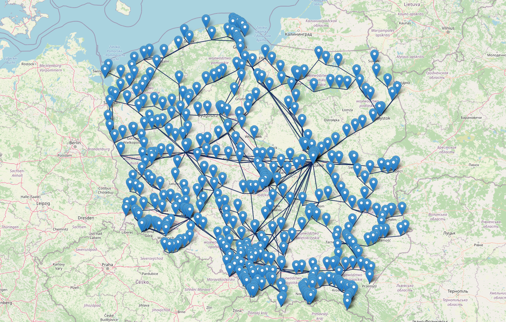

[![Contributors][contributors-shield]][contributors-url]
[![Forks][forks-shield]][forks-url]
[![Stargazers][stars-shield]][stars-url]
[![Issues][issues-shield]][issues-url]
[![MIT License][license-shield]][license-url]
[![LinkedIn][linkedin-shield]][linkedin-url]


<!-- PROJECT LOGO -->
<br />
<p align="center">
  <a href="https://github.com/simonusher/pkp_network_science">
    
  </a>
  <h3 align="center">PKP network scraping and analysis</h3>
  <p align="center">
    A railway connections (Polskie Koleje Państwowe) network scraper with simple Folium visualizations. Created as part of network science course on WrUST.
    <br />
    <!-- <a href="https://github.com/simonusher/pkp_network_science"><strong>Explore the docs »</strong></a> -->
    <a href="https://github.com/simonusher/pkp_network_science/issues">Report Bug</a>
    ·
    <a href="https://github.com/simonusher/pkp_network_science/issues">Request Feature</a>
  </p>
</p>


<details open="open">
  <summary><h2 style="display: inline-block">Table of Contents</h2></summary>
  <ol>
    <li>
      <a href="#about-the-project">About The Project</a>
      <ul>
        <li><a href="#built-with">Built With</a></li>
      </ul>
    </li>
    <li>
      <a href="#getting-started">Getting Started</a>
      <ul>
        <li><a href="#prerequisites">Prerequisites</a></li>
        <li><a href="#installation">Installation</a></li>
      </ul>
    </li>
    <li><a href="#usage">Usage</a></li>
    <li><a href="#license">License</a></li>
    <li><a href="#contact">Contact</a></li>
    <li><a href="#acknowledgements">Acknowledgements</a></li>
  </ol>
</details>


<!-- ABOUT THE PROJECT -->
## About The Project
The project was created as part of network science course on WrUST. It contains a scraper script that allows to download PKP railway connections and represent them as a graph. The notebooks available in this repo then use GeoPy and Folium to generate visualizations of downloaded network.

### Built With
* python 3.8.2,
* [BeautifulSoup](https://www.crummy.com/software/BeautifulSoup/bs4/doc/),
* [Folium](https://python-visualization.github.io/folium/),
* [GeoPy](https://geopy.readthedocs.io/en/stable/),
* [Jupyter](https://jupyter.org/),
* [Pandas](https://pandas.pydata.org/),
* [Numpy](https://numpy.org/).


<!-- GETTING STARTED -->
## Getting Started

To get a local copy up and running follow these simple steps.

### Prerequisites
* python, tested on 3.8.2.
If you have pyenv, you can install this version using:
  ```sh
  pyenv install 3.8.2
  ```

### Installation

1. Clone the repo
   ```sh
   git clone https://github.com/simonusher/pkp_network_science.git
   ```
2. Create a virtual environment and activate it (optional):
   ```sh
   python -m venv env
   env/bin/activate
   ```
3. Install the requirements:
   ```sh
   pip install -r requirements
   ```


<!-- USAGE EXAMPLES -->
## Usage

You can run the scraper script using
  ```sh
  python scraper.py [OPTIONS] [carriers].
  ```
You can get a help message by running:
  ```sh
  python scraper.py --help
  ```

You can then use the coord_geopy.ipynb and map_vis_folium.ipynb notebooks to geocode the localizations and generate map visualizations.


<!-- LICENSE -->
## License

Distributed under the MIT License. See `LICENSE` for more information.


<!-- CONTACT -->
## Contact

Szymon Woźniak - swozniak6@gmail.com

Project Link: [https://github.com/simonusher/pkp_network_science](https://github.com/simonusher/pkp_network_science)


[contributors-shield]: https://img.shields.io/github/contributors/simonusher/pkp_network_science.svg?style=for-the-badge
[contributors-url]: https://github.com/simonusher/pkp_network_science/graphs/contributors
[forks-shield]: https://img.shields.io/github/forks/simonusher/pkp_network_science.svg?style=for-the-badge
[forks-url]: https://github.com/simonusher/pkp_network_science/network/members
[stars-shield]: https://img.shields.io/github/stars/simonusher/pkp_network_science.svg?style=for-the-badge
[stars-url]: https://github.com/simonusher/pkp_network_science/stargazers
[issues-shield]: https://img.shields.io/github/issues/simonusher/pkp_network_science.svg?style=for-the-badge
[issues-url]: https://github.com/simonusher/pkp_network_science/issues
[license-shield]: https://img.shields.io/github/license/simonusher/pkp_network_science.svg?style=for-the-badge
[license-url]: https://github.com/simonusher/pkp_network_science/blob/master/LICENSE.txt
[linkedin-shield]: https://img.shields.io/badge/-LinkedIn-black.svg?style=for-the-badge&logo=linkedin&colorB=555
[linkedin-url]: https://www.linkedin.com/in/szymon-wo%C5%BAniak-00505318a/